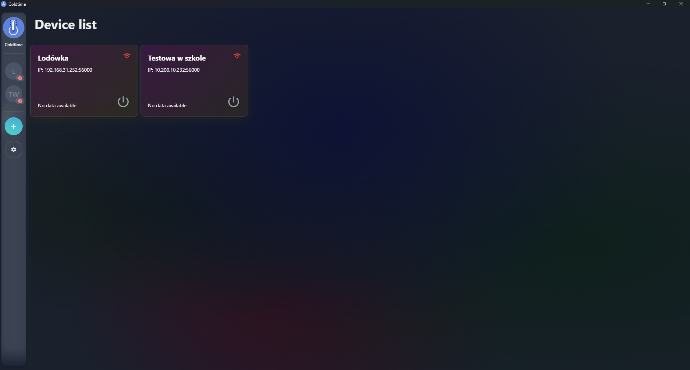
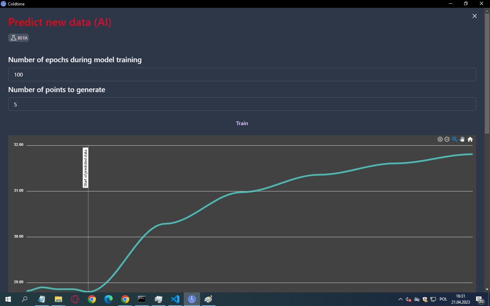

    
    <h2 align="center">Coldtime</h2>

---

A desktop app for persisting values (i.e. temperature) over time got from multiple devices. Created for _POL-EKO_ to manage their _SMART PRO_ fridge data.

---

## Showcase

For more screenshots, please see `./resources`

## Some of the features include:

- 🗣️ Bilingualism
- 📱 Multi-device support
- 🌐 "Network discovery" - Coldtime automatically detects devices on the network without the need for manually entering the device data, such as IP address
- 🔔 Notifications for when a device becomes available/unavailable, with the program icon in the tray changing color to red if any of the added devices is unavailable
- 📈 Historical data - with the option to select a start and end date, and optimization for compressing large amounts of data points with the user choosing the maximum number of points to display on the graph themself
- 📊 Chart with zoom and scroll capabilities, and a table presenting the data neatly and clearly
- 📉 Minor statistics on the data, such as average temperature for a given day and time since the device status changed
- 📤 Data export to Microsoft Excel (.xlsx), CSV, and JSON (depending on the language of the application)
- ⚙️ Customizable settings for data retrieval frequency, storage, and maximum graph points
- 🔄 Background operation, with the program icon in the taskbar requiring a click to reopen and the option to fully exit in the menu tray
- ✏️ Ability to edit or delete devices, with each device having its friendly name
- 🤖 BETA: AI model predicting the future data (temperature)

[Docs in Polish](./pl_coldtime_docs.pdf)

Made with ❤ by [Artur Nowak](https://github.com/Arciiix)
